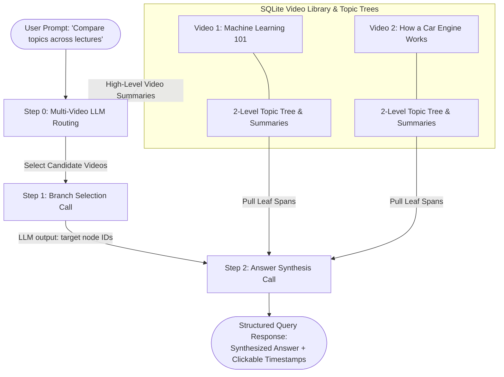

# Vectorless RAG Lecture Navigator

A high-performance web application that builds a **hierarchical topic tree (PageIndex style)** from YouTube lecture transcripts and performs **vectorless RAG** using LLM reasoning over topic summaries—**with zero embeddings and zero vector databases**.

---

## Technical Overview & Architecture

Standard RAG systems rely on chunking text (e.g., 500-token chunks) and performing cosine similarity search over vector embeddings. For long, highly structured technical lectures (1–2 hours), traditional vector RAG suffers from severe failure modes:
1. **Out-of-context matching**: A query about "activation functions" matches random 1-sentence snippets across disparate parts of a 2-hour lecture without understanding macro-topic context.
2. **Multi-topic queries fail**: Questions spanning multiple topics (e.g., "How does pre-training differ from fine-tuning?") pull fragmented chunks rather than coherent section structures.

### Why Vectorless Hierarchical Retrieval over Vector Similarity RAG?

This project implements **tree-based reasoning retrieval**:
- **Structured Indexing**: Instead of chunking and embedding, the ingestion pipeline constructs a **2-level hierarchical topic tree** (`Sections` → `Subsections` → `Leaf Transcript Spans`) and generates concise summaries for every non-leaf node.
- **LLM Reasoning over Summaries**: Query-time retrieval passes *only* the top 2 levels of node summaries to the LLM. The LLM reasons over the high-level roadmap of the lecture to select target section branch IDs.
- **Targeted Leaf Context Extraction**: Only the raw transcript spans of the selected branch nodes are pulled to synthesize the final answer with precise timestamp markers.
- **Multi-Video Vectorless RAG**: Toggle "All Lectures" mode to query across your entire video library using a 3-step routing pipeline (Video Routing $\rightarrow$ Tree Branch Selection $\rightarrow$ Answer Synthesis).

---

## 3-Step Vectorless Retrieval Pipeline



1. **Step 0 (Video Routing)** *(Multi-video queries)*:
   - Evaluates user prompt against high-level summaries of all ingested videos in the library to select candidate lectures.
2. **Step 1 (Branch Selection)**:
   - Feeds Level-1 (Section) and Level-2 (Subsection) titles + summaries + node IDs to Groq LLM.
   - Raw leaf transcript text is **explicitly withheld** to keep the prompt small (~1–2k tokens).
3. **Step 2 (Answer Synthesis)**:
   - Fetches raw leaf transcript text and timestamp bounds for the selected node(s).
   - Synthesizes a thorough answer with exact timestamp markers (`[start_ts, label]`).

---

## Key Features

- **Ingested Lectures Library & History**: View, switch between, and manage all ingested lectures in SQLite.
- **Persistent Q&A Chat History**: Chat history is automatically stored per video and restored upon selecting a lecture.
- **Smart Inline Timestamp Linkifier**: Clicking timestamp references inside AI answers or tree items seeks the YouTube iframe player and highlights the active tree section.
- **Batch YouTube Ingestion**: Input single or multiple YouTube URLs (comma/newline separated).

---

## Project Structure

```
vectorless-rag-navigator/
├── pyproject.toml            # Package dependencies managed via uv
├── Dockerfile                # Multi-stage container definition
├── docker-compose.yml        # Docker compose configuration
├── README.md                 # Technical spec and documentation
├── data/
│   └── navigator.db          # SQLite database (persisted trees & chat history)
├── src/
│   ├── main.py               # FastAPI backend entry point & REST API
│   ├── config.py             # Application configuration
│   ├── db.py                 # SQLAlchemy ORM models (VideoModel, TreeNodeModel, QueryHistoryModel)
│   ├── models.py             # Pydantic schemas & LLM response formats
│   ├── services/
│   │   ├── youtube.py        # YouTube transcript extraction & chunk stitching
│   │   ├── llm_client.py     # Groq LLM client wrapper with structured output & model fallback
│   │   ├── ingestion.py      # Topic tree construction & summary generator
│   │   ├── retrieval.py      # Vectorless RAG retrieval engine (Single & Multi-Video)
│   │   └── storage.py        # SQLite persistence repository
│   └── static/
│       ├── index.html        # SPA layout with YouTube player, tree viewer & video library
│       ├── style.css         # Modern glassmorphism dark mode UI
│       └── app.js            # Client-side state, player handler & inline timestamp linkifier
└── tests/
    ├── test_navigator.py     # Data model & chunk stitching unit tests
    ├── test_persistence.py   # SQLite database & transaction unit tests
    └── test_multi_and_history.py # Multi-video RAG & chat history integration tests
```

---

## Getting Started

### Prerequisites
- [uv](https://github.com/astral-sh/uv) (Python package manager)
- Python 3.10+
- `GROQ_API_KEY` configured in `.env`

### Running the Application

1. **Install Dependencies**:
   ```bash
   uv sync
   ```

2. **Start Development Server**:
   ```bash
   uv run uvicorn src.main:app --port 8000
   ```
   Open `http://localhost:8000` in your web browser.

3. **Run Unit Tests**:
   ```bash
   uv run pytest
   ```

---

## Docker Deployment

Build and run containerized:

```bash
docker-compose up --build
```
Access the application at `http://localhost:8000`.
